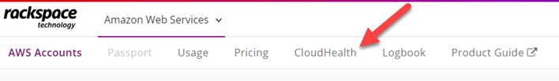
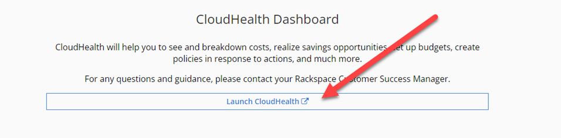

# Billing

## Resource Tagging

The CostCenter tag should be applied to all resources. This enables us to break up the AWS bill and charge to specific areas if needed. The CostCenter is composed of the Functional Area and Cost Center from our SAP system. With these two IDs, the financial team can allocate the costs to the correct team.

!!! Example
    CostCenter: FA1234567890_CC1234567890

Some AWS resources cannot be tagged or are billed in a way where the resource tag does not appear. For example, the Private Certificate Authority is properly tagged with the CostCenter. However, on the bill, we are charged for "CREATE_CERTIFICATE_AUTHORITY" as an operation rather than the resource. The operation cannot be tagged, so the bill shows this as an untagged cost. We are still researching how this can be resolved.

Another way resources are not tagged correctly is when AWS creates them on our behalf. For example, in Terraform, you may create a Private Endpoint that is tagged appropriately. When the AWS creates the Private Endpoint, it automatically creates an Elastic Network Interface (ENI) as part of the creation process. The ENI is not tagged or named. In these cases, you should attempt to retrieve the child resource and tag it appropriately.

## Rackspace

Our billing with AWS is funneled up to a single master payer account. CDCR purchases AWS services through the statewide contract with the California Department of Technology (CDT). Currently, Rackspace was awarded the contract to procure AWS services. This means that Rackspace owns our master payer account. If you look at the email address tied to the master payer account, you will see it ends in "@accounts.manage.rackspace.com".

When negotiating the contract, AWS provided a discount to the State of California. However, both Rackspace and CDT add an administrative fee on top of those resources. This could cause confusion when reviewing costs in AWS. For example, an EC2 instance may cost $10 in the AWS console, but when we receive the bill, both Rackspace and CDT add their fee and the true cost is $15. To eliminate this confusion, Rackspace implemnts policies against our account to block access to billing information.

The only way to view billing information is through the Rackspace CloudHealth Dashboard.

### CloudHealth

The CloudHealth dashboard is provided by Rackspace to view billing information. It also provides information around rightsizing and security recommendations as an added bonus.

There are many different ways to view billing information such as by service or account. The EIS budgets team primarily looks at the [CostCenter](billing.md#resource-tagging) tag to divide costs.

CloudHealth uses single sign-on through Entra ID. Access is granted by being a member of an appropriate Active Directory group.

!!! Prerequisites
    You must be a member of an appropriate CloudHealth group. The groups are stored in accounts.cdcr.ca.gov\CDCR\Apps\AWS. The group names begin with App-CDCR-AWS-CloudHealth. Allow 60 minutes for replication after adding a user to the group.

#### Logging In

The CloudHealth dashboard is managed by Rackspace. Use the steps below to login to CloudHealth.

1. Browse to [https://login.rackspace.com/federate](https://login.rackspace.com/federate)
1. Enter you user name.
    1. We are using standard accounts since this is only billing information.
1. In the top left, select the Amazon Web Services product.
    1. { : style="height:200px;width:150px" }
1. In the top center, click CloudHealth.
    1. { : style="height:100px;width:800px" }
1. Click Launch CloudHealth
    1. { : style="height:200px;width:800px" }
1. If this is your first time logging in, you will be prompted to accept the Terms of Service.