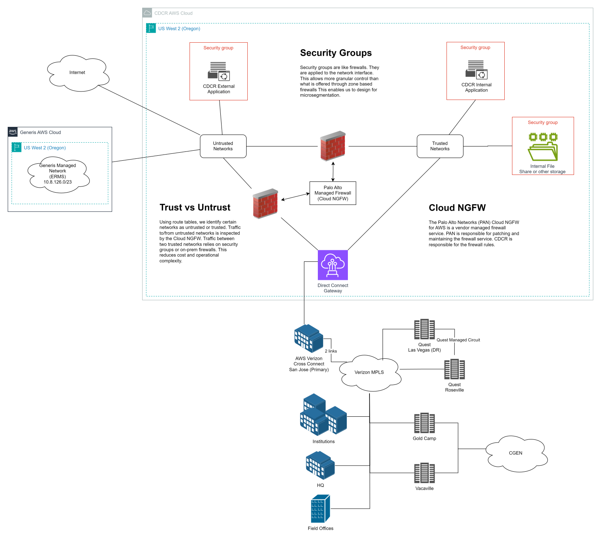

# Network

The CDCR AWS environment is set up like a hub and spoke. Each region contains one hub which is a Transit Gateway. VPCs are created as spokes that connect to the Transit Gateway. Most spokes will contain a workload. The workload could be an application or it might be a shared service that fulfills an operational need. There are two connections treated differently.

`Direct Connect`
:   Our on-premises network connects to AWS via Direct Connect. This is a private circuit provided by Verizon that connects to AWS.

`Inspection`
:   The Inspection VPC performs firewall and traffic inspection for the network. We use a Palo Alto Cloud Next Generation Firewall (CNGFW) to perform this function. The Inspection VPC protects north/south traffic. It also protects east/west traffic when either the source or destination in as untrusted network. See [Routing Tables](routing-tables.md) for more information.

## Diagram
### Simple

This diagram provides a high level overview of how the AWS network is configured.

### Detailed

This diagram provides technical details on how the AWS network is configured.
